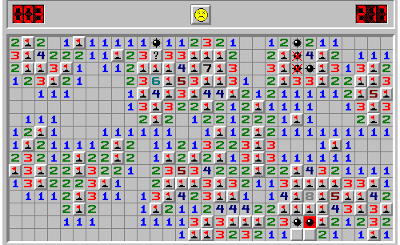
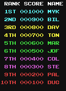

# Minesweeper code base



## Table of contents 📚
- [Minesweeper code base](#minesweeper-code-base)
  - [Table of contents 📚](#table-of-contents-)
  - [Game Description 🕹️](#game-description-️)
  - [Features 🎈](#features-)
  - [Optional Features 🔨](#optional-features-)
  - [Intended Use 🎮](#intended-use-)
  - [Check test coverage🧪](#check-test-coverage)
  - [Launch springboot](#launch-springboot)
  - [Environment setup🕶️](#environment-setup️)
  - [Issue Priority Labels 🚩](#issue-priority-labels-)
  - [Code Quality Tools](#code-quality-tools)

## Game Description 🕹️

[Minesweeper](<https://en.wikipedia.org/wiki/Minesweeper_(video_game)>) is a puzzle video game created by Microsoft in the 1990's.
The goal of the game is to click on all the cells in the game grid which do not contain bombs.
When you click on a tile, the number of bombs on neighboring tiles is shown.
If you click on a tile which contains a bomb, then you have lost.
Points are given to the player based on how quickly the player was able to clear the grid, by clicking on all non-bomb tiles.

The goal of our project is to make a working version of minesweeper.
A [screenshot](#minesweeper-code-base) of the game is shown at the top of this file.
A picture of how the high-score list might look like is presented below.



## Features 🎈

- **Basic Minesweeper Gameplay**: Clear a grid of tiles without triggering mines.
- **High-Score List**: Players can submit their names and scores after successfully completing a game.

## Optional Features 🔨

- **Difficulty Levels**: Choose between Easy, Medium, and Hard levels.
- **Game Saving**: Save the current game state and resume later. Note: Saved games will not be eligible for the high-score list to prevent cheating.

## Intended Use 🎮

1. Open the application
2. The main screen is presented
3. Click a button to restart the timer
4. Play the game, and don't lose 😄
5. Submit your name to the high-score list
6. Click the high-score button to view the high-score list

## Check test coverage🧪

1. **Navigate to the minesweeper directory**

```cmd
cd minesweeper
```

2. **Run the tests**

```cmd
mvn clean test
```

3. **Generate Combined JaCoCo Report**

- A JaCoCo report is automatically generated each time tests are run.
- To create a combined test coverage report across all modules, ensure that all tests are executed and then run:

```cmd
mvn verify
```

4. **Viewing the Combined Test Results**

- Navigate to **coverage/target/site/jacocco-aggregate** directory in your project folder.
- Locate the **index.html** file. You can open this file in your preferred web browser to view the test coverage results.
- _Optionally, if you have a live server extension in your code editor (such as Visual Studio Code), you can right-click on the index.html file and select "Open with Live Server" to view the results._
- _Optionally, if you want its possible to view test result in the jacocco.csv and jacocco.xml as well._

## Launch springboot
1. **Navigate to storage**
```
cd storage
```
2. **Run the restAPI**
```
mvn javafx:run
```
3. **Kill the server if already running**
```
netstat -ano | findstr :6969
taskkill /PID [PID-number] /F
```
4. **Go to web browser**
http://localhost:6969/highscores

## Environment setup🕶️

- Java: JDK 17
- Maven: Version 3.8.1

## Issue Priority Labels 🚩

To streamline our development process and provide clear guidance on the importance of each task, we use a color-coded labeling system for our GitLab issues. Each color signifies a specific level of priority, detailed as follows:

Green: Optional Features 🟢

- What it means: Issues marked green are considered optional. They are "nice-to-haves" but not essential for the project's core functionality.
- Action: Address these issues only after resolving all higher-priority tasks.

Orange: Medium Priority 🟠

- What it means: Issues marked orange need to be implemented but are not immediate concerns.
- Action: These issues should be addressed in the next release cycle. They take precedence unless there are critical issues that require immediate attention.

Red: High Priority 🔴

- What it means: Issues marked red are critical and must be resolved immediately as they either block further development or introduce serious bugs.
- Action: Prioritize these issues, they must be resolved before attending to tasks of lower priority.

## Code Quality Tools

- _[SpotBugs](https://spotbugs.github.io/)_: is automatically executed during the build process when running "mvn clean install". It serves to analyze the compiled Java bytecode to detect a variety of potential issues in the code.
- _[Checkstyle](https://checkstyle.sourceforge.io/)_: is helping write Java code that adheres to a coding standard. It automates the process of formating javacode, ensuring that every team member formats the code using the same settings.
  - [What is Checkstyle?](./FAQ.md#what-is-checkstyle)
  - [How do i clean my code with checkstyle?](./FAQ.md#how-do-i-clean-my-code-with-checkstyle)
  - [How do i change checkstyle settings?](./FAQ.md#how-do-i-change-checkstyle-settings)
